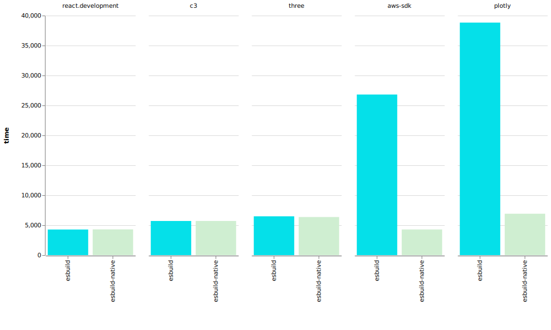

# esbuild-native

Experimental native esbuild library for Node.js.

## Building

You'll need Go and Node.js.

Install the dependencies in this folder using `npm i` (ignore failed build), and then run `npm run build-init` and `npm run build`.

To test it out, open `node` and `require('.')`. You'll need to call `startService()` before using `minify(source)`, and then `stopService` after you're done.

## Benchmarking

Run `node bench/run.js`.

